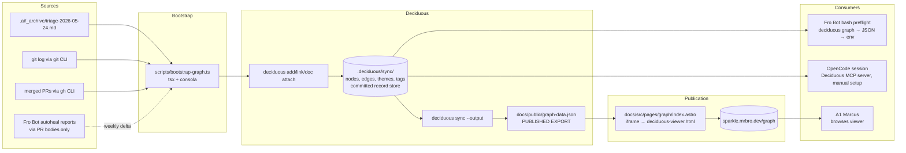

> **Revision note (2026-09-06):** Revised against Deciduous v0.17.1 following a hands-on spike; the v0.15.0-era storage assumptions (committed SQLite DB, JSONL event logs, vendored viewer) are replaced throughout with observed v0.17.0+ behavior.
>
> **Revision note (2026-09-07):** Approved scope correction: Unit 1's viewer-mode and Q&A/document-access acceptance criteria are corrected to match verified v0.17.1 behavior — see Scope Boundaries below and Units 1 and 6 for specifics. Browser-based document-body reading and model-backed Q&A success are explicitly deferred beyond v1.

## Overview

Adopt the [Deciduous](https://notactuallytreyanastasio.github.io/deciduous/) Rust CLI + MCP server + embedded HTML viewer to build a living decision graph for `marcusrbrown/sparkle`. Seed it from sparkle's git history and the Lane 5–triaged `.ai/` planning archive; refresh weekly via a dedicated workflow that opens an auto-PR; expose it as (a) a published viewer at `sparkle.mrbro.dev/graph` iframe-embedded inside the existing Starlight site and (b) input context for Fro Bot's scheduled maintenance and autoheal runs. PR-time inline citation is explicitly deferred to a post-v1 iteration.

## Problem Frame

Sparkle has 1660+ commits and six months of pure dependency-bump activity since the Oct 2025 audit. Institutional memory — why `@sparkle/theme` uses `TokenTransformer`, why `apps/moo-dang` is a Web Worker shell, why the audit chose factory mocks — lives in scattered surfaces: planning artifacts about to be archived, merged PR bodies, conventional commits, and (going forward) Fro Bot's daily reports. None of it is queryable; none of it surfaces when an agent or contributor touches the relevant code. Manual compound-docs writing did not happen during the treadmill year and probably will not happen during the next one. Sister repos (`marcusrbrown/marcusrbrown`, `mrbro.dev`) re-derive the same context from scratch on every agent run because there is nowhere to retrieve it from. The cost shape is "every agent run pays full archaeology cost forever," and it grows monotonically as the repo accumulates history. (see origin: `docs/brainstorms/2026-05-24-sparkle-decision-graph-requirements.md`)

## Requirements Trace

- R1. Validation spike completes locally before any subsequent unit ships _(brainstorm R1, F1)_
- R2. `scripts/bootstrap-graph.ts` walks the three sources (Lane 5 triage list + ≥12mo merged PR bodies + full `git log`) and emits Deciduous CLI invocations _(brainstorm R2)_
- R3. `.deciduous/` artifacts committed: `config.toml` and the `sync/{nodes,edges,themes,tags}/*.json` record store; everything else under `.deciduous/` (SQLite cache, `narratives.md`, `documents/`, `.version`) is gitignored by default _(brainstorm R3)_
- R4. `.github/workflows/decision-graph.yaml` runs weekly, re-runs the bootstrap, syncs, opens an auto-PR with deltas, triggers docs redeploy upon merge _(brainstorm R4)_
- R5. Graph published at `sparkle.mrbro.dev/graph` via iframe-embed in the existing Starlight site _(brainstorm R5)_
- R6. Viewer ships with empty-state explanation, freshness indicator, and node-type legend; no separate docs page _(brainstorm R6)_
- R7. Fro Bot's `MAINTENANCE_PROMPT` and `AUTOHEAL_PROMPT` invoke `deciduous graph`/`show` from a bash preflight before the agent step _(brainstorm R7)_
- R8. OpenCode sessions use Deciduous's MCP server, opt-in per session — `deciduous init --opencode` does not wire this up (it only writes an `AGENTS.md`-referencing `opencode.json`), so MCP registration is a separate, manual step _(brainstorm R8)_

## Scope Boundaries

- **PR-time inline citation in Fro Bot reviews is out of scope.** Defer until F3 agent-context demonstrates retrieval value for at least one quarter. (origin scope boundary)
- **Cross-repo graphs and a portfolio-level meta-graph are out of scope.** Sister repos each adopt independently if interested. (origin scope boundary)
- **No replacement of `.changeset/` or the existing CHANGELOG flow.** The graph is additive context. (origin scope boundary)
- **No retroactive backfill of PR comment threads.** Use PR bodies + commits + `.ai/` only. (origin scope boundary)
- **No human-curated node-by-node review during bootstrap.** Trust the script; fix the script for systemic issues, use `deciduous archaeology pivot` for individual corrections. (origin scope boundary)
- **No separate `/api/graph-architecture/` Starlight docs page.** Legend + freshness indicator inside the viewer carry the entry-level explanation. (origin scope boundary)
- **No Astro Starlight theming of the embedded viewer for v1.** Stock Deciduous viewer styling is acceptable. (origin assumption)
- **Browser-based reading of attached-document bodies is out of scope for v1** (added 2026-09-07). The live viewer's node-detail panel shows attachment metadata (filename, size, MIME type, description) only; the static viewer/export shows no attachment metadata at all. Local CLI/MCP-level document attachment and metadata remain in scope; a public document reader is a distinct, unbuilt feature.
- **Successful model-backed Q&A in the published viewer is out of scope for v1** (added 2026-09-07). The viewer's `Ask about the code` control opens a local input without issuing a network request; a query was never submitted, so whether submission is wired end-to-end is untested, not disproven. A separate live-server backend (`/api/ask`) exists, backed by a local `claude -p` call — v1 adds no deployment backend for this, and the control may render without a working submit path.
- **No direct-to-main pushes from `decision-graph.yaml` in v1.** Use auto-PR via `peter-evans/create-pull-request` matching `regenerate-docs.yaml`'s posture. Direct-push is a documented post-v1 fallback once weekly-PR review noise becomes a measurable problem.

### Deferred to Separate Tasks

- **Lane 5 `.ai/` archive execution** (move PROMOTE/ARCHIVE/DELETE-classified files per the triage report) is its own work item but Unit 2 below performs the _triage-report persistence_ step it depends on, and Unit 4 reads the persisted triage. Full archive moves happen in the Lane 5 PR, not this plan's PRs.
- **`actions/checkout` v5.0.1 → v6.0.2 alignment** in `main.yaml` and `deploy-docs.yaml` (already filed as a session note from PR #1662 review).

## Context & Research

### Relevant Code and Patterns

- **TypeScript script style** — `scripts/health-check.ts:1-260` and `scripts/validate-dependencies.ts:1-205` set the convention: `#!/usr/bin/env tsx`, `consola` for output, typed interfaces, helper functions, graceful `allowFailure`, `process.exit(1)` on hard violations. `scripts/health-check.ts:44-65` is the canonical `runCommand()` shell-out wrapper.
- **Test file convention** — Co-located `.test.ts` files (e.g. `apps/moo-dang/src/shell/parser.test.ts`). `__tests__/` subdirs are the exception, not the rule (only one case: `apps/fro-jive/components/__tests__/StyledText.test.tsx`).
- **TS scripts wired via root `package.json`** — `scripts/package.json:1-7` is ESM-only; commands run as `tsx scripts/<name>.ts`. **The package has no `test` script today** — Unit 4 adds one to make `scripts/` test-runnable via `pnpm test`.
- **CLI mocking** — `@sparkle/test-utils` does NOT cover external-CLI mocking. Pattern is Vitest's `vi.mock('node:child_process')` or wrapping shell-out behind a thin helper and mocking the helper.
- **Composite Action `./.github/actions/setup-ci`** (`./.github/actions/setup-ci/action.yaml:1-44`) — pnpm + node + optional Zig + cache restore + `pnpm install`. Reuse verbatim.
- **`deploy-docs.yaml:1-228`** — prior art for "publish to `sparkle.mrbro.dev`". Single-artifact GitHub Pages model: build → `actions/upload-pages-artifact` (path `./docs/dist`) → `actions/deploy-pages`. Concurrency `deploy-docs-${{ github.ref }}` with `cancel-in-progress: false`. Secrets: `TURBO_TOKEN`, `TURBO_TEAM`. Path trigger watches `docs/**` and `packages/**`.
- **`regenerate-docs.yaml:1-360`** — prior art for "commit deltas via App identity, through auto-PR". GitHub App token via `APPLICATION_ID` + `APPLICATION_PRIVATE_KEY`, then `peter-evans/create-pull-request` for auto-PR. Unit 5 mirrors this posture rather than direct-pushing.
- **`.github/workflows/fro-bot.yaml`** — landed in PR #1662; prompts encoded as workflow `env` blocks. Unit 7 extends `MAINTENANCE_PROMPT` and `AUTOHEAL_PROMPT` in place.
- **Astro custom pages** — `docs/src/pages/` is absent today; introducing it for `/graph/` is the established Astro escape hatch. Existing precedent for interactive Astro/React widgets: `docs/src/components/interactive/StorybookEmbed.tsx:1-206` + `StorybookEmbedAstro.astro:1-99` (iframe-based embed; closest existing pattern to the Deciduous viewer integration).
- **Astro static asset surface** — `docs/public/` (already contains `CNAME` for the custom domain). New static assets for the viewer land here.
- **Astro Starlight site config** — `docs/astro.config.mjs:1-260`. `site: 'https://sparkle.mrbro.dev'`, `customCss: ['./src/styles/sparkle-theme.css']`, sidebar config.
- **Empirical chore(deps) density** — last 200 commits contain 103 `chore(deps)` commits (51.5%) with no clean weekly/daily cadence. Unit 4 batches by run-window or consecutive-burst, not calendar.

### Institutional Learnings

- `docs/solutions/` does not exist yet in sparkle (confirmed). No prior compound-docs learnings to apply; treat as greenfield.

### External References

- Deciduous tutorial: <https://notactuallytreyanastasio.github.io/deciduous/>
- Deciduous MCP reference: <https://notactuallytreyanastasio.github.io/deciduous/mcp.html>
- Deciduous source: <https://github.com/notactuallytreyanastasio/deciduous>
- Deciduous self-dogfooded demo (1,175 nodes): <https://notactuallytreyanastasio.github.io/deciduous/demo/>
- Astro Starlight `src/pages/` + custom routes — <https://starlight.astro.build/guides/pages/>
- Astro `public/` static asset serving — <https://docs.astro.build/en/basics/project-structure/#public>

## Key Technical Decisions

### Iframe-embed the Deciduous viewer at `/graph/` inside Starlight

Chosen because `/graph/` is part of the docs information architecture, not a second product surface. Embedding keeps one GitHub Pages artifact, one custom domain, one deployment workflow, one availability story, and matches the existing `StorybookEmbedAstro.astro` iframe-isolation pattern. The iframe boundary is intentional: Deciduous viewer CSS/JS cannot leak into Starlight, and Starlight theme changes cannot break graph internals.

Rejected alternatives:

- **Sibling Pages deployment** — cleaner ownership boundary, but adds a second deploy target, routing/domain complexity, and another failure mode for a v1 docs-adjacent feature.
- **Native Starlight/React reimplementation** — better visual integration, but turns a tool-adoption plan into viewer maintenance.
- **Direct link to Deciduous-hosted/demo viewer** — least work, but loses sparkle's stable URL contract and self-hosted public artifact.

Second-order impact: iframe sandbox policy becomes part of the integration contract. If the Deciduous viewer later needs workers, storage, downloads, or cross-origin fetches, `/graph/` may need sandbox relaxation; revisit when that surfaces.

### Bootstrap script is TypeScript via `tsx`, not Bash

TypeScript is chosen because the bootstrap has parsing, classification, normalization, idempotency, and error-shaping responsibilities. Those are application logic, not glue. Keeping it in `scripts/*.ts` makes parser fixtures and type-checked behavior possible; Bash would be acceptable only for orchestration and would turn the important parts into brittle string processing.

Rejected alternatives:

- **Bash-only** — simpler in CI, worse for parser tests, structured errors, JSON handling, and long-term maintenance.
- **OpenCode/agent-driven bootstrap** — flexible, but non-deterministic and not reproducible enough for CI.
- **Deciduous narrative/manual flow only** — useful for correction, not for recurring full-repo harvest.

Second-order impact: the TypeScript script becomes the graph's canonical compiler. Its heuristics need versioning and fixture coverage because changing them rewrites institutional history.

### Weekly refresh opens an auto-PR via `peter-evans/create-pull-request`, not direct-to-main

Matches `regenerate-docs.yaml`'s existing posture and preserves PR review as the gate on bot-authored generated content. The brainstorm originally specified direct-push; the security review surfaced that direct-push to `main` is materially riskier than the prior-art workflow (which uses the same GitHub App for read+commit but opens a PR rather than pushing). For v1, weekly auto-PR is the conservative posture even though it adds review surface.

Rejected alternatives:

- **Direct-push via GitHub App token** — faster freshness, no review noise, but introduces a new trust boundary not justified by v1 scope. Documented as a post-v1 fallback if weekly auto-PR noise becomes a measurable problem.
- **Schedule-disabled, manual-only workflow** — most conservative, but defeats the "graph stays current within 7 days" success criterion.

Second-order impacts to surface in System-Wide Impact: PR ownership/review responsibility for weekly mechanical PRs (auto-merge candidates? labeled `automation/decision-graph`?), commit-message provenance (include input window + node/edge delta counts, not just "update graph"), staged-paths allowlist (PR commit must touch only `.deciduous/**`).

### `.deciduous/sync/` record store lives committed at repo root; the SQLite cache does not

As of Deciduous v0.17.0, the committed surface is a Git-native record store — `.deciduous/sync/{nodes,edges,themes,tags}/*.json` — not a SQLite database. `deciduous init` generates a `.gitignore` that excludes everything under `.deciduous/` except `config.toml` and `sync/`, plus a `.gitattributes` entry registering a custom merge driver for `.deciduous/sync/**`. The local `deciduous.db` SQLite file is a per-machine cache, gitignored by default. CI, OpenCode sessions, and contributors all read the same committed record state from the checkout; the SQLite cache is rebuilt locally from it. This intentionally trades repo weight and JSON-diff churn for deletion-friendly infrastructure: removing the feature means deleting `.deciduous/`, the docs route, and the workflow — no migrations.

Rejected alternatives:

- **External DB / object store** — better for binary churn, worse for auth, backups, local reproducibility, and contributor access.
- **Regenerate on every use** — avoids committed record-store churn, but makes every CI / agent run pay the archaeology cost again.
- **Only commit the JSON export** — easier for docs / Fro Bot, but loses Deciduous's native state, MCP / local editing, and the correction workflow.
- **Store under `docs/`** — convenient for Pages trigger, but wrong ownership boundary; the graph is repo knowledge, not docs-only content.

Mitigations: defined size budget (see Risks & Dependencies); no arbitrary large binary attachments in v1 (prefer in-repo markdown references); never hand-edit the record-store JSON files — use Deciduous commands, which is also what the registered merge driver expects on conflict.

### Fro Bot CI consumes the graph via `deciduous graph` JSON dump, not via MCP

CI uses `deciduous graph` because Fro Bot needs a deterministic, read-only snapshot before the agent step. MCP is session-oriented and useful for interactive query loops; in CI it adds another long-running protocol surface, auth/debug complexity, and harder failure modes for little benefit.

Rejected alternatives:

- **MCP in CI** — richer query surface, but more moving parts and worse debuggability.
- **Read SQLite directly** — avoids CLI install, but couples Fro Bot to Deciduous internals.
- **Consume `docs/public/graph-data.json`** — avoids DB access, but couples CI context to the publication artifact shape (which exists to serve the viewer, not agents).

Second-order impact: the JSON-payload selection becomes an API contract between the graph producer and the Fro Bot prompt. When the full graph grows too large to inject (Open Questions), the selection / filtering strategy must be designed before the limit is hit, not after.

### Export directly to `docs/public/graph-data.json` via `deciduous sync --output`

`deciduous sync` writes `docs/graph-data.json` by default, which would collide with sparkle's Starlight project root. Passing `--output docs/public/graph-data.json` writes the export directly to its publication target — no separate mirror/copy step, and no second committed copy to keep in sync. The committed `.deciduous/sync/` record store remains the source of truth that `deciduous sync` reads from; `docs/public/graph-data.json` is regenerated output.

**Consequence (simplification, not a caveat)**: because the export lands directly under `docs/public/`, it already falls inside `deploy-docs.yaml`'s existing `docs/**` path trigger — no path-filter extension is needed. This removes the "graph refreshes but the production site stays stale" failure mode the mirror-copy design would otherwise have required guarding against.

Rejected alternatives:

- **Sync to the default `docs/graph-data.json`, then copy in a build step** — extra moving part for no benefit once `--output` does the job directly.
- **Workflow writes both a `.deciduous/`-local copy and `docs/public/graph-data.json`** — duplicates source-of-truth and increases conflict/diff churn for no upside.
- **Viewer fetches directly from a path under `.deciduous/`** — exposes repo-internal directory layout in the public URL and requires copying `.deciduous/` into `docs/dist/`.

### Stable `graph-data.json` filename (no content-hash versioning)

Stable filename keeps the embedded viewer simple and preserves a durable public data URL. Content-hashed filenames improve cache busting but require manifest generation or HTML rewriting and complicate the static iframe contract. For v1, freshness indicator + GitHub Pages' conservative default caching is enough.

Rejected alternatives:

- **`graph-data.<hash>.json`** — better cache correctness, but requires viewer-side manifest awareness.
- **Timestamp query parameter** — easy cache busting, but makes freshness/debugging less deterministic.
- **Inline data into the viewer HTML** — avoids the caching split, but bloats HTML and couples data deploy to the viewer asset's release cadence.

Second-order impact: stale cache must be observable. The freshness indicator should read graph-metadata timestamps from inside the JSON, not deployment time.

### Persist Lane 5 triage as `.ai/_archive/triage-2026-05-24.md` before bootstrap

The bootstrap reads it directly; session memory is not load-bearing infrastructure. Captured as Unit 2.

### Dedicated weekly workflow rather than a Fro Bot category

Keeps graph automation independent from Fro Bot's prompt-evolution surface; failures don't cascade between systems; cadence can diverge from Fro Bot's daily schedule.

### The published viewer is the only docs surface for v1

Cut the separately-planned `/decisions` or `/graph-architecture` Starlight page; the viewer's empty-state explanation, legend, and freshness indicator carry the entry-level explanation.

### PR-time inline citation deferred from v1

See Scope Boundaries.

## Open Questions

### Resolved During Planning

- **Viewer surface (linked-out vs embedded)** → Iframe-embed inside Starlight at `/graph/`. Single Pages artifact, established `StorybookEmbedAstro.astro` precedent.
- **Bootstrap script language** → TypeScript via `tsx`, matching `scripts/*.ts` convention.
- **Storage for `.deciduous/`** → `.deciduous/sync/` record store + `config.toml` committed at repo root; `.gitignore` excludes everything else (SQLite cache, `narratives.md`, `documents/`, `.version`) per `deciduous init`'s generated ignore rules.
- **Fro Bot CI query surface** → `deciduous graph` JSON dump from a bash preflight step, not MCP.
- **Workflow concurrency** → `decision-graph-${{ github.ref }}` group with `cancel-in-progress: false`, matching `deploy-docs.yaml`'s shape.
- **Commit posture for weekly refresh** → Auto-PR via `peter-evans/create-pull-request`, matching `regenerate-docs.yaml`. Direct-push deferred as post-v1 fallback.
- **Publication path for `graph-data.json`** → `deciduous sync --output docs/public/graph-data.json` writes directly to the publication target. No mirror/prebuild step and no `deploy-docs.yaml` path-filter change needed — `docs/public/` already falls under its existing `docs/**` trigger.
- **Test file location for Unit 4** → Co-located `scripts/bootstrap-graph.test.ts` matching `apps/moo-dang/src/shell/parser.test.ts` pattern.

### Deferred to Implementation

- **Node-classification heuristic in `scripts/bootstrap-graph.ts`** — how aggressively to map commits / PRs / `.ai/` files into `goal` / `decision` / `action` / `outcome` / `observation` types vs leaving the long tail as `observation`. Calibrate against F1 spike output.
- **JSON payload size limits for Fro Bot prompts** — full graph may exceed practical input limits as it grows. Pick a filtering / pagination strategy when measurement shows it's needed; pre-empt the threshold (don't wait for the breakage).
- **Retrieval-events metric implementation** — does the Fro Bot perpetual report need a structured `graph_citations: [<node_id>...]` field, or is a free-text grep for `[decision-graph node #` sufficient? Decide after Unit 7 lands.
- **Incremental-ingestion tracking mechanism for the weekly refresh** — the refresh must ingest only inputs it hasn't already recorded (full re-bootstrap is not an option — see Unit 4's Idempotency constraint). A watermark file, a query against existing `.deciduous/sync/` records, or ingesting only inputs newer than the last run are all plausible; the choice needs its own evidence and is deferred to the implementing unit.
- **Initial size budget threshold for `.deciduous/`** — set during Unit 1 spike based on actual generated size; warn when exceeded.

## Output Structure

```text
sparkle/
├── .deciduous/                            # Deciduous state (new top-level dir; mostly gitignored)
│   ├── config.toml                        # Committed — Deciduous config
│   └── sync/                              # Committed — Git-native record store
│       ├── nodes/*.json
│       ├── edges/*.json
│       ├── themes/*.json
│       └── tags/*.json
│       # deciduous.db (SQLite cache), narratives.md, documents/, .version
│       # all stay local — gitignored per Deciduous's own init-generated .gitignore
├── .ai/
│   └── _archive/                          # New subdir (created by Unit 2)
│       └── triage-2026-05-24.md           # Persisted Lane 5 triage report
├── scripts/
│   ├── bootstrap-graph.ts                 # New
│   └── bootstrap-graph.test.ts            # New, co-located
├── docs/
│   ├── public/
│   │   ├── graph-data.json                # Written directly by `deciduous sync --output`
│   │   └── deciduous-viewer.html          # Captured once from a scratch `deciduous init` run
│   └── src/
│       └── pages/
│           └── graph/
│               └── index.astro            # New /graph/ route, iframe wrapper
└── .github/workflows/
    └── decision-graph.yaml                # New weekly incremental-refresh workflow
```

> The structure is a scope declaration; the implementer may adjust if implementation reveals a better layout. The per-unit `**Files:**` sections remain authoritative.

## High-Level Technical Design

> _This illustrates the intended data flow and is directional guidance for review, not implementation specification. The implementing agent should treat it as context, not code to reproduce._



The control flow has two distinct, non-interchangeable modes — Deciduous's record files embed per-run UUIDs and timestamps, so a full bootstrap re-run produces a disjoint record set rather than the same one:

1. **One-shot bootstrap (Unit 4)**: bootstrap script walks all sources exactly once, emits CLI invocations, populates the committed `.deciduous/sync/` record store, runs `deciduous sync --output docs/public/graph-data.json` to publish. Never re-run wholesale afterward.
2. **Weekly refresh (Unit 5)**: a distinct incremental mode of the bootstrap script runs in CI, ingesting only inputs not already recorded, appends to `.deciduous/sync/`, re-runs `deciduous sync --output docs/public/graph-data.json`, and opens an auto-PR with deltas under the GitHub App identity. On merge, `deploy-docs.yaml` fires automatically — `docs/public/graph-data.json` already falls under its existing `docs/**` path trigger.

Fro Bot's CI consumption (Unit 7) reads the committed record store via `deciduous graph` in a bash preflight step injected before the existing `Run Fro Bot` agent step.

## Implementation Units

- [x] **Unit 1: Validation spike (local-only, no PR)**

**Goal:** Confirm Deciduous's CLI + viewer + sync flow works against sparkle locally before any code change ships. This is the R1 gate.

**Requirements:** R1

**Dependencies:** None (this unit gates all others)

**Files:**

- No files committed. Local-only experiment in a sparkle worktree (or scratch checkout).

**Approach:**

- Install Deciduous via `cargo install deciduous` or Homebrew (per Deciduous install docs).
- Run `deciduous init` (skip `--opencode` — verified it does not wire up MCP, see below) inside a scratch checkout, not the working worktree — `init` also writes `docs/index.html`, Pages-deploy workflows, and `.opencode/`/`AGENTS.md` scaffolding that would collide with sparkle's own (see Unit 3 for the full list and how it's scoped down).
- Seed 5–10 nodes manually from recent PRs and 1–2 `.ai/plan/*.md` files using `deciduous add`, `deciduous link`, `deciduous doc attach`. Cover at least one `goal → option → decision → action → outcome` chain.
- Run `deciduous serve` and confirm the live graph and node metadata (including attached-document metadata) render correctly.
- Run `deciduous sync`, then serve the exported `docs/` directory as plain static files and confirm the viewer renders the graph across its static navigation: `Chains`, `Timeline`, `Graph`, `DAG`, `Story`, `Log` (Git History), `Roadmap`. There is no dedicated `Archaeology` view; graph corrections are made via the CLI (see below). A missing `roadmap-items.json` renders a graceful empty state.
- Inspect the exported `docs/graph-data.json` (default path; `--output` overrides it — Unit 6 uses `--output docs/public/graph-data.json`) and document its `{nodes: [...], edges: [...]}` schema, including which fields present on committed `.deciduous/sync/` records (e.g. `author`, tracked on both node and edge records) do or don't reach the export — this is the basis of the "public field allowlist" in Operational Notes. Separately: `--output` redirects only the graph JSON; `deciduous sync` writes `git-history.json` to its own default location regardless — the Git Log/Correlation/Timeline static views need `git-history.json` served alongside the viewer and `graph-data.json`, a bounded file-layout question for Unit 4/Unit 6 to resolve.
- Run `deciduous graph` and confirm the JSON dump is structurally sound for downstream Fro Bot consumption.
- Run `deciduous archaeology pivot` against a seeded node with the exact command logged, then confirm the DB, record store, and export agree via `deciduous sync`.
- Confirm the viewer's `Ask about the code` control opens a local input without issuing a network request. Do not submit a query against it or against the live server's `/api/ask` backend — out of scope for Unit 1.
- Measure size of generated `.deciduous/` for the small seed; multiply by an expected node count to set the initial `.deciduous/` size-budget threshold.

**Patterns to follow:** Deciduous's own tutorial flow at <https://notactuallytreyanastasio.github.io/deciduous/>.

**Test scenarios:**

- Happy path: `deciduous serve` (live mode) renders node detail panels with attached-document metadata (filename, size, MIME type, description) — metadata only, not document content/body.
- Happy path: the exported static bundle, served as plain files (not via `deciduous serve`), renders the same graph across `Chains`, `Timeline`, `Graph`, `DAG`, `Story`, `Log`, `Roadmap`; the static node-detail view shows no attachment metadata at all — that's a live-viewer-only feature.
- Happy path: `deciduous sync` produces a non-empty, structurally-valid `graph-data.json` and a separate `git-history.json`, both needed by the Git Log/Correlation/Timeline static views.
- Happy path: `deciduous graph` JSON dump matches the schema described in the librarian research brief.
- Edge case: `deciduous archaeology pivot` correctly corrects an individual node, with DB/record-store/export agreement re-verified via `deciduous sync` afterward.
- Failure mode: capture any blocker (CLI gap, viewer regression, license/distribution issue, upstream signal of abandonment) and STOP the plan. If a blocker surfaces, open an issue describing the gap and reopen the brainstorm.

**Verification:**

- A working local graph exists; the static viewer renders across `Chains`, `Timeline`, `Graph`, `DAG`, `Story`, `Log`, `Roadmap`, and the CLI archaeology/pivot correction workflow is exercised and confirmed.
- Browser-based reading of attached-document bodies and a successful model-backed Q&A response are not required for this verification (see Scope Boundaries).
- The implementer has hands-on confidence that the brainstorm's premises hold.
- The `docs/graph-data.json` schema is documented (field list; `author` is present on both node and edge committed `.deciduous/sync/` records but does not appear in the export — field-name absence from the export is not a guarantee that every remaining field's content is public-safe; see the public-field allowlist in Operational Notes).
- An initial `.deciduous/` size-budget threshold is recorded: provisional warning at ~2 MB of committed record-store JSON (roughly 4,500–5,000 records at the measured sample's ~400–500 bytes/record average), estimated from actual spike-seed measurements, not a guarantee — re-measure after real usage before treating it as policy.
- If any spike step fails: this plan pauses; brainstorm is reopened.

- [ ] **Unit 2: Persist Lane 5 `.ai/` triage report**

**Goal:** Move the Lane 5 triage classification (currently in the prior session's history) into a committed artifact at `.ai/_archive/triage-2026-05-24.md` so Unit 4's bootstrap script has a deterministic, re-readable input.

**Requirements:** R2 (dependency)

**Dependencies:** Unit 1 must complete successfully

**Files:**

- Create: `.ai/_archive/triage-2026-05-24.md` (contains the full triage report: KEEP-AS-IS, PROMOTE, ARCHIVE, DELETE classifications + live cross-references + migration order)
- Modify: `.markdownlint-cli2.yaml` if needed (already excludes `.ai/**` per repo-research — confirm)
- Modify: `.prettierignore` if needed (already excludes `.ai/` per repo-research — confirm)

**Approach:**

- Reconstruct the triage report from the prior session output. Format as markdown with sections matching the original report's structure.
- Commit to `.ai/_archive/triage-2026-05-24.md` as a single-file change.
- Do NOT execute the actual `.ai/` archive moves in this unit — that's the Lane 5 PR's job. Unit 4's bootstrap reads the triage report and resolves the original file paths whether they're still at the original location or moved to `_archive/`.

**Patterns to follow:** Triage report format used elsewhere in `.ai/audit/audit-final-report.md`.

**Test scenarios:**

- Happy path: `.ai/_archive/triage-2026-05-24.md` exists and contains all 22 file classifications.
- Edge case: Unit 4's parser can read the file and resolve all classified paths to either the original `.ai/<subdir>/` location or the eventual `.ai/_archive/<subdir>/` location.

**Verification:**

- File is present and parseable.
- `git diff` shows a single-file addition.

- [ ] **Unit 3: Initialize Deciduous in sparkle repo**

**Goal:** Land the `.deciduous/` skeleton (config + empty record store) at the repo root, plus the `.gitignore`/`.gitattributes` entries Deciduous needs, without adopting `init`'s sparkle-colliding scaffolding.

**Requirements:** R3

**Dependencies:** Unit 1 must complete successfully

**Files:**

- Create: `.deciduous/config.toml`, `.deciduous/sync/` (empty `nodes/`, `edges/`, `themes/`, `tags/` subdirs)
- Modify: root `.gitignore` — add the Deciduous block (`.deciduous/*` then re-include `!.deciduous/config.toml` and `!.deciduous/sync/`)
- Modify: root `.gitattributes` — add `.deciduous/sync/** merge=deciduous linguist-generated=true` and document the corresponding `merge.deciduous.*` Git config as a local per-contributor setup step (not committed)
- Modify: root `README.md` — add a one-paragraph "Decision graph" section pointing at `sparkle.mrbro.dev/graph`, noting only `.deciduous/config.toml` and `.deciduous/sync/` are committed (the SQLite cache, `narratives.md`, and `documents/` stay local), and that hand-editing the record-store JSON is unsupported (use Deciduous commands, which respect the registered merge driver)
- Modify: `llms.txt` — add a brief decision-graph reference once Unit 6 ships, or in this unit as a placeholder pointing at the brainstorm doc

**Approach:**

- Run `deciduous init` in a scratch location **outside the repo** (e.g. `/tmp`), not inside a sparkle checkout — `init` also writes `docs/index.html`, `docs/.nojekyll`, `docs/graph-data.json`, `.github/workflows/deploy-pages.yml` and `.github/workflows/cleanup-decision-graphs.yml` (a second, competing Pages deployer using floating-tag actions sparkle doesn't allow), and `.opencode/`/`opencode.json`/`AGENTS.md` (which would collide with sparkle's existing ones). None of that is adopted wholesale.
- Skip `--opencode` entirely for v1 — it does not register Deciduous's MCP server (the generated `opencode.json` only sets `instructions: ["AGENTS.md"]`) and would still collide with sparkle's existing `.opencode/`/`AGENTS.md`. MCP wiring, if pursued, is a separate manual step (see Open Questions).
- From the scratch run, port only: `.deciduous/config.toml`, the empty `.deciduous/sync/` directory structure, the `.gitignore` block, and the `.gitattributes` merge-driver line. Discard everything else the scratch run generated.
- Add a short README section explaining the directory's purpose to head off "what is this?" PRs.
- Land as a single small PR; the `.deciduous/sync/` record store grows in Unit 4.

**Test scenarios:**

- Happy path: `deciduous nodes` against the committed (empty) record store returns an empty result without error.
- Happy path: `deciduous serve` against the committed state starts and renders an empty-state UI.
- Edge case: confirm no files under `.github/workflows/`, `docs/index.html`, `.opencode/`, or `opencode.json` were committed by this unit — the scratch-init scaffolding must not leak into the tracked tree.

**Verification:**

- `git status` shows only the intended `.deciduous/config.toml` + `.deciduous/sync/` skeleton, `.gitignore`/`.gitattributes` additions, and the README + llms.txt additions.
- `deciduous` commands run against the committed state without error.

- [ ] **Unit 4: Bootstrap script (`scripts/bootstrap-graph.ts`)**

**Goal:** A reproducible, re-runnable TypeScript script that walks the three sources and emits Deciduous CLI invocations to populate the graph. This is the heart of v1.

**Requirements:** R2, R3

**Dependencies:** Unit 2 (triage report committed), Unit 3 (`.deciduous/` initialized)

**Files:**

- Create: `scripts/bootstrap-graph.ts`
- Create: `scripts/bootstrap-graph.test.ts` (co-located, Vitest)
- Modify: `scripts/package.json` — add `"test": "vitest run"` so `scripts/` participates in `pnpm test` via the workspace test task
- Modify: root `package.json` — add `bootstrap-graph` script wired as `tsx scripts/bootstrap-graph.ts`
- Modify (as side-effect of running): `.deciduous/sync/{nodes,edges,themes,tags}/*.json` (new record files with fresh per-run UUIDs — see Idempotency constraint below), `docs/public/graph-data.json` (via `deciduous sync --output`); the local SQLite cache updates too but stays gitignored

**Approach:** The script runs three passes in a strict order so later passes can link to nodes earlier passes created:

1. **Triage pass (first)**: Read `.ai/_archive/triage-2026-05-24.md`. For each PROMOTE + ARCHIVE classified file: invoke `deciduous add` (mapping triage category → node type per a small heuristic table), then `deciduous doc attach <node_id> <path> --ai-describe` for the source markdown, then `deciduous link` for any cross-references the triage report already identifies.
2. **Git log pass (second)**: For each merged-to-main commit since repo inception: invoke `deciduous add action "<commit summary>" --commit <sha> --date <iso> -c <confidence>` where confidence is 80 for PR-merge commits, 60 for direct-to-main. `chore(deps)` commits batch into one periodic `observation` node per **bootstrap run-window** or per **consecutive deps-burst** (not calendar — empirical research showed 51.5% of recent commits are `chore(deps)` with no clean weekly/daily cadence).
3. **PR-body pass (third)**: For merged PRs ≥12 months back + any PR referenced by an in-scope `.ai/` artifact: invoke `deciduous add decision "<PR title>" -p "<PR body summary>" --files "<file list from PR>" --commit <merge SHA> -c 75`. **The `-c 75` confidence holds only if the PR-body pass can link to action nodes the git-log pass already created**; if linking fails (commit-node-not-found), lower that PR's confidence to ~70.
4. **Run `deciduous sync --output docs/public/graph-data.json`** to publish the export directly to its publication target.

**Secrets/PII safety**: before any `deciduous add` or `doc attach`, the script's input normalizer scrubs known-secret patterns (`(?i)(token|secret|password|api[_-]?key|bearer|authorization)[:=]\s*\S+`, URLs containing `://user:pass@`, AWS-style access keys, etc.). Failed scrubs fail the run loudly rather than silently committing leaked content.

**Idempotency constraint (not a risk to mitigate)**: Deciduous record files embed a random UUID (`change_id`) and wall-clock timestamps at creation, and edge IDs derive from those UUIDs. Two runs seeding identical content produce entirely disjoint record sets — this is observed, deterministic Deciduous behavior, not a tuning problem to solve. The bootstrap is therefore a **one-shot seeding operation**: run once against the full source set, its output committed by this unit's PR, and never re-run wholesale afterward. Re-running the full bootstrap would rewrite every file under `.deciduous/sync/` and orphan the prior graph's node/edge IDs. Unit 5's weekly refresh runs in a distinct **incremental** mode that ingests only new inputs — see Unit 5 and the Open Questions entry on the ingestion-tracking mechanism.

**Execution note:** Test-first for parsers in `scripts/bootstrap-graph.test.ts` (triage parser, commit classifier, PR-body normalizer, secret-scrub regex set). Characterization-test CLI orchestration with mocked `node:child_process` calls.

**Patterns to follow:**

- `scripts/health-check.ts:44-65` — `runCommand()` shell-out wrapper with `execSync`, `silent`, `allowFailure`.
- `scripts/validate-dependencies.ts:1-205` — typed interfaces, `consola` logging, structured error returns.
- `apps/moo-dang/src/shell/parser.test.ts` — co-located `.test.ts` style for parser units.
- `scripts/accessibility-audit.sh:1-76` — shell-out patterns (looping over an input list).

**Test scenarios:**

- Happy path: Given a triage report with N PROMOTE entries and M ARCHIVE entries, running the script populates the DB with at least N+M nodes plus their attached source documents.
- Happy path: Given a git log with K merged-to-main commits, running the script populates the DB with K `action` nodes (minus the `chore(deps)` batched ones) whose `--commit` metadata matches.
- Happy path: PR-body decisions successfully link to existing action nodes when the merge SHA was already added.
- Happy path: `chore(deps)` commits batch into a single `observation` node per bootstrap run; `deciduous nodes --type observation` returns exactly one such node after a full run.
- Edge case: Empty git log (fresh repo) — script completes without error, DB has only the triage-derived nodes.
- Edge case: Triage report references a file that no longer exists (file was moved or deleted) — script logs a warning, skips that node, continues.
- Edge case: PR body contains markdown the parser can't handle (broken HTML, unexpected encoding) — script logs and skips, doesn't crash.
- Edge case: PR-body pass cannot find the action node to link against — decision node is still created, confidence drops to ~70, warning logged.
- Error path: `deciduous` binary not on PATH — script exits with a clear error message naming the missing dependency.
- Error path: `gh` CLI not authenticated — script exits with a clear remediation message.
- Error path: Secret-scrub catches a token-like string in a PR body — script aborts the run with a clear remediation message (no partial commit).
- Integration (`scripts/bootstrap-graph.test.ts`): parser units co-located with the script, covering triage / commit-classifier / PR-body / secret-scrub layers.
- Integration: CLI orchestration tests mock `execSync` / `spawn` and assert call order across the three passes (triage → git log → PR bodies → sync).
- Integration: After the one-shot bootstrap run, `docs/public/graph-data.json` contains the expected node/edge counts (validated against a baseline).

**Verification:**

- `pnpm test --filter scripts` (or equivalent — once `scripts/package.json` has the test script) runs cleanly.
- A full bootstrap run produces a queryable graph with at least one `goal`/`decision`/`action`/`outcome` chain per Lane 5 PROMOTE-classified artifact.
- `deciduous serve` renders the produced graph and the chains read as plausibly correct (not perfect — "good enough to query" per origin scope).
- `pnpm bootstrap-graph` is wired and works from a clean checkout. **Running it a second time against an already-seeded repo is a misuse, not a refresh** — see the Idempotency constraint above; the weekly incremental mode (Unit 5) is the only supported re-run path.

- [ ] **Unit 5: Weekly refresh workflow (`.github/workflows/decision-graph.yaml`)**

**Goal:** Run the bootstrap script's incremental mode weekly, sync, open an auto-PR with deltas under the GitHub App identity, trigger docs redeploy when merged.

**Requirements:** R4

**Dependencies:** Unit 4 (the bootstrap script exists and works) AND Unit 6 has shipped (so the docs publication target exists before we start refreshing it). See Rollout Verification.

**Files:**

- Create: `.github/workflows/decision-graph.yaml`
- No `deploy-docs.yaml` changes needed — `docs/public/graph-data.json` already falls under its existing `docs/**` path trigger.

**Approach:**

- Triggers: `schedule` (weekly cron, e.g., Sunday 06:00 UTC — staggered off existing schedules: Fro Bot 05:00 autoheal / 17:00 maintenance, sister repos earlier) and `workflow_dispatch`.
- Concurrency: `decision-graph-${{ github.ref }}` group, `cancel-in-progress: false` — matches `deploy-docs.yaml` shape.
- Permissions: workflow-level `contents: read`; the App-token step requests `permission-contents: write` + `permission-pull-requests: write` only for the PR-opening step (least privilege).
- Steps:
  1. `actions/checkout` (pinned full SHA).
  2. `./.github/actions/setup-ci` composite action.
  3. Install Deciduous (cache the binary by version — explicit pin matching Unit 1's recorded version; either `cargo install deciduous` or download from GitHub Releases — pick the lower-overhead option in implementation).
  4. Run `pnpm bootstrap-graph --incremental` (Unit 4's script, in its incremental mode — ingests only inputs not already recorded; see Unit 4's Idempotency constraint and the Open Questions entry on the tracking mechanism. **Never run the full/one-shot mode here.**).
  5. Run `deciduous sync --output docs/public/graph-data.json` (the incremental script already runs this, but the workflow re-runs it explicitly for safety). Consider `deciduous sync --no-pages` if CI shouldn't also generate Pages-deploy scaffolding as a side effect — verify the flag's exact behavior during Unit 1.
  6. Pre-PR audit: compute the delta vs `HEAD`'s `.deciduous/sync/` state; print a summary (changed paths, node/edge counts); fail if any change is outside `.deciduous/sync/**` or `docs/public/graph-data.json`.
  7. Run secret-scan over the staged delta — fail loudly on any match (defense in depth; the bootstrap script already runs this on inputs).
  8. If non-empty delta: get a GitHub App token via `actions/create-github-app-token` (`APPLICATION_ID` + `APPLICATION_PRIVATE_KEY` secrets — already provisioned per repo conventions), then open an auto-PR via `peter-evans/create-pull-request` with title `chore(graph): weekly decision-graph refresh (YYYY-MM-DD)`, body containing the audit summary from step 6, labels `automation/decision-graph` + `automation`. Path scope: `.deciduous/sync/**` and `docs/public/graph-data.json`.
  9. Failure handling: any non-zero step appends or updates a single perpetual GitHub issue titled `Decision graph automation: needs attention` (labels `decision-graph`, `automation-failure`). One-issue-per-recurring-failure model matching Fro Bot's perpetual-issue pattern. On success after prior failure, the issue is closed with a brief comment.
- Branch protection note: `main` does NOT currently require PR reviews per repo settings, so the PR can be merged by Marcus directly without a separate reviewer; this is intentional for v1 and reviewed if branch-protection policy tightens.

**Patterns to follow:**

- `.github/workflows/deploy-docs.yaml` — concurrency keying, `setup-ci` invocation.
- `.github/workflows/regenerate-docs.yaml:138-145, 253-316` — GitHub App token flow + `peter-evans/create-pull-request` for bot-authored PRs.
- `.github/workflows/fro-bot.yaml` — schedule cron staggering, pinned-SHA conventions, perpetual-issue-failure pattern.

**Test scenarios:**

- Happy path: Workflow runs on schedule with no new content since last run — completes successfully with no PR opened (and any prior failure-tracking issue closed if it existed).
- Happy path: Workflow runs with new commits since last run — produces a delta, opens an auto-PR as the GitHub App; merging the PR triggers `deploy-docs.yaml` re-run.
- Edge case: Workflow runs when the committed `.deciduous/sync/` record store doesn't exist yet (first deploy of this unit before Unit 4's initial bootstrap is committed) — fails fast with a clear error rather than silently corrupting state.
- Failure path: Bootstrap script exits non-zero (e.g., `gh` rate-limited) — workflow fails, no partial commit, perpetual failure issue is opened/updated.
- Failure path: GitHub App token fetch fails — workflow fails before any mutation, failure issue updated.
- Failure path: Pre-PR audit detects a staged change outside `.deciduous/sync/**` or `docs/public/graph-data.json` — workflow fails loudly (this is the path-scope safety boundary).
- Failure path: Secret-scan finds a token-like string in the delta — workflow fails with the location; no PR opened.
- Integration: Manual `workflow_dispatch` produces the same effect as a scheduled run.

**Verification:**

- `gh workflow run decision-graph.yaml` from a clean state produces a successful run.
- A scheduled run that finds new commits produces a PR from the App identity (not the maintainer's identity).
- Merging the PR fires `deploy-docs.yaml` automatically — `docs/public/graph-data.json` already falls under its existing `docs/**` path trigger; no filter extension needed.
- A simulated failure produces the perpetual-failure issue; a subsequent successful run closes it.

- [ ] **Unit 6: Astro Starlight `/graph/` route + viewer integration**

**Goal:** Publish the Deciduous viewer at `sparkle.mrbro.dev/graph` as an iframe-embedded page inside the existing Starlight site.

**Requirements:** R5, R6

**Dependencies:** Unit 4 (`docs/public/graph-data.json` exists — Unit 4's initial one-shot bootstrap runs `deciduous sync --output docs/public/graph-data.json`)

**Files:**

- Create: `docs/src/pages/graph/index.astro` (custom Starlight page with iframe wrapper, freshness indicator, legend, empty-state explanation)
- Create: `docs/public/deciduous-viewer.html` (the viewer HTML captured once during Unit 3's scratch-init-and-port step — the same `docs/index.html` Deciduous's `init` generates upstream — not independently vendored/re-captured per CLI-version bump)
- Modify: `docs/astro.config.mjs` — optional sidebar entry for `/graph/`; otherwise rely on top-nav or README link

**Approach:**

- Implement `docs/src/pages/graph/index.astro` as a thin Starlight-themed wrapper around an `<iframe>` pointing at `/deciduous-viewer.html`. **Verified during Unit 1: there is no `?data=` query-parameter override** — the compiled viewer's data-source selection is a hard-coded runtime predicate (hostname/port based, not a query string) that resolves to fixed relative paths (`./graph-data.json`, `./git-history.json`, `./roadmap-items.json`) when the origin is not `localhost`/`127.0.0.1`/`0.0.0.0` and either has no explicit port or is a `.github.io` host. Based on the compiled predicate (inferred from source, not verified against an actual deployment), sparkle's production custom domain — no explicit port, non-`.github.io` hostname — should select the relative-path branch. `deciduous-viewer.html` and `graph-data.json` (and `git-history.json`, once Unit 4/6's file-layout question above is resolved) must be served side-by-side from the same `docs/public/` directory — no mirroring/rewriting step needed beyond that co-location.
- Apply the most restrictive iframe `sandbox` attribute compatible with the viewer; exact requirements are implementation-time verification against the live embed, not proven by any standalone pass to date. Do not assume sandbox compatibility is already validated. Avoid `allow-same-origin` unless implementation-time testing proves a specific viewer feature requires it — the local Q&A affordance renders without a network call and does not, by itself, justify relaxing the sandbox.
- Above the iframe: a small Astro-rendered legend (`goal` / `option` / `decision` / `action` / `outcome` / `observation` / `revisit` with one-line definitions) and a freshness indicator showing the last-sync timestamp read from `graph-data.json`'s metadata at build time.
- Below the iframe: a small empty-state explanation that renders only when the graph has <50 nodes (Astro can compute this at build time by counting nodes in `graph-data.json`).
- No docs-build sync/prebuild step is needed: `docs/public/graph-data.json` is written directly by `deciduous sync --output docs/public/graph-data.json` in Unit 4 (initial) and Unit 5 (weekly incremental refresh), and already falls under `deploy-docs.yaml`'s existing `docs/**` path trigger.
- **Tradeoff, stated plainly**: because the viewer now ships upstream as generated output rather than a plan-owned artifact, there is no independent provenance chain (no SHA256 pin, no per-release re-capture procedure) — an update means repeating the scratch `deciduous init` capture from Unit 3 and diffing the result. This removes real maintenance work (no vendoring/pinning process to run on every Deciduous bump) but also removes the plan's ability to audit or pin exactly which viewer bytes are served independent of a full re-capture.

**Patterns to follow:**

- `docs/src/components/interactive/StorybookEmbedAstro.astro:1-99` — existing iframe-embed pattern. Mirror its iframe attributes (sandbox, loading, dimensions), header treatment, and CSS isolation.
- Existing custom CSS surface: `docs/src/styles/sparkle-theme.css`.

**Test scenarios:**

- Happy path: `pnpm --filter @sparkle/docs dev` renders `/graph/` with the iframe loading the viewer and the legend + freshness indicator visible.
- Happy path: `pnpm --filter @sparkle/docs build` produces `docs/dist/graph/index.html` and includes the viewer + data file in the static output.
- Happy path: Visiting `sparkle.mrbro.dev/graph` after a deploy shows a working graph viewer (covered in Rollout Verification).
- Edge case: When `graph-data.json` has <50 nodes, the empty-state explanation renders.
- Edge case: When `graph-data.json` is missing (build runs before Unit 4 has produced one), the build fails fast with a clear error.
- Edge case: When `deciduous-viewer.html` is missing, the page renders a friendly fallback rather than a broken iframe.
- Integration: Visual regression — capture a screenshot of `/graph/` and pin it as a baseline; subsequent runs flag unexpected viewer chrome changes. (Use existing `packages/storybook/test/visual-regression/` infra if appropriate; otherwise defer to a follow-up.)
- Integration: Starlight navigation: `/graph/` is reachable from the docs site.

**Verification:**

- The `/graph/` route works locally via `pnpm --filter @sparkle/docs dev`.
- A `pnpm --filter @sparkle/docs build` succeeds with the new route.
- After Unit 5 ships, the production site at `sparkle.mrbro.dev/graph` renders the live graph (see Rollout Verification → Initial Production Gate).

- [ ] **Unit 7: Fro Bot prompt extensions for graph queries**

**Goal:** Extend Fro Bot's `MAINTENANCE_PROMPT` and `AUTOHEAL_PROMPT` to consume the committed graph as input context via a bash preflight step.

**Requirements:** R7

**Dependencies:** Unit 4 (graph is populated)

**Files:**

- Modify: `.github/workflows/fro-bot.yaml` — add a "Load decision graph context" step that runs `deciduous graph > /tmp/sparkle-graph.json` (or similar) before the existing `Run Fro Bot` step. Pass the file path as an env var (`SPARKLE_GRAPH_CONTEXT`) to the agent step.
- Modify: `.github/workflows/fro-bot.yaml` `MAINTENANCE_PROMPT` env block — add a section instructing the agent to read `$SPARKLE_GRAPH_CONTEXT` for prior decisions before producing the daily report, and to cite specific node IDs / titles when the report's "Cross-project intelligence" or "Code quality" sections reference patterns that match graph nodes.
- Modify: `.github/workflows/fro-bot.yaml` `AUTOHEAL_PROMPT` env block — same addition; specifically instructs the autoheal categories to check the graph for prior `outcome` / `revisit` nodes related to a current failing PR's root cause and to cite them in the perpetual autohealing report's "Errored PRs" entries.

**Approach:**

- The preflight step installs Deciduous (cached by version, matching Unit 5's install strategy) and dumps the graph JSON. Skip MCP — CI doesn't benefit from the round-trip.
- The prompts get a new section header: "Decision graph context (available at `$SPARKLE_GRAPH_CONTEXT`)" with usage instructions specific to each prompt's existing structure.
- Citations in Fro Bot's perpetual report use a structured form: `[decision-graph node #N: <title>]` — predictable enough for the retrieval-events metric to grep against later.
- The prompt explicitly requires node IDs when graph context informs a claim. Absence of weekly citations after rollout is a product signal that the integration isn't compounding, not just a test failure.
- Do NOT add the graph to `PR_REVIEW_PROMPT` — that's R8 (cut from v1) territory per the brainstorm's scope boundary.

**Patterns to follow:**

- `.github/workflows/fro-bot.yaml` — existing env-block prompt structure. Insert new sections at consistent indentation.
- Existing autoheal prompt's "Cross-project intelligence" section — mirror the citation style.

**Test scenarios:**

- Happy path: A scheduled maintenance run produces a daily report that includes at least one citation of a specific graph node when the report's content overlaps with the graph.
- Happy path: A scheduled autoheal run that touches a known-recurring failure mode cites the relevant prior `outcome` node.
- Edge case: Graph contains zero nodes (e.g., before Unit 4's first bootstrap commits) — preflight step succeeds with an empty JSON dump and the agent prompts handle empty context gracefully (no broken templating).
- Edge case: Graph JSON exceeds practical agent input limits — the preflight step truncates or summarizes (mechanism TBD per Deferred to Implementation). For v1, log a warning and pass the truncated payload; revisit when measured.
- Error path: Deciduous CLI install fails in the preflight — workflow fails before the agent step, surfacing a clear remediation message.
- Integration: The `$SPARKLE_GRAPH_CONTEXT` file is readable from the agent step's environment.

**Verification:**

- A `gh workflow run fro-bot.yaml -f mode=maintenance` from a clean state produces a report citing at least one graph node.
- A `gh workflow run fro-bot.yaml -f mode=autoheal` produces a report citing at least one graph node when relevant.
- The success-criterion target of ≥1 retrieval event per week becomes measurable (free-text grep against the perpetual reports for the `[decision-graph node #` pattern is sufficient for v1).

## System-Wide Impact

- **Interaction graph:** New surface area touches three pre-existing systems: (1) `.github/workflows/deploy-docs.yaml` is triggered automatically when the weekly auto-PR (Unit 5) merges, since `docs/public/graph-data.json` already falls under its existing `docs/**` path trigger — no filter change needed; (2) `.github/workflows/fro-bot.yaml` is mutated in Unit 7 to add a preflight step; (3) the Astro Starlight site at `docs/` gains a new top-level `/graph/` route + two new `docs/public/` assets.
- **Error propagation:** A failed one-shot bootstrap (Unit 4) blocks the weekly refresh workflow (Unit 5); a failed weekly refresh leaves the graph stale but does not corrupt it (the incremental refresh only appends, and a failed run makes no partial commit) — failure surfaces as a perpetual GitHub issue (Unit 5 step 9). A failed graph load in Fro Bot (Unit 7) blocks the agent step — explicit upstream failure rather than silent context loss.
- **State lifecycle risks:** Concurrent `decision-graph.yaml` runs (scheduled + manual dispatch racing) are prevented by the concurrency group. Because `narratives.md` and the SQLite cache are gitignored (local-only, not committed), there's no maintainer-edit race on committed state to reconcile; the only committed surface (`.deciduous/sync/`) resolves conflicts via Deciduous's registered Git merge driver.
- **API surface parity:** The `sparkle.mrbro.dev/graph` URL becomes a stable contract. Once published, breaking it in a future iteration requires a redirect.
- **Integration coverage:** Unit 7's prompt changes interact with the Fro Bot agent runtime; the actual retrieval behavior is only observable in production. Unit tests cover the preflight step's shape, not the agent's interpretation.
- **Unchanged invariants:** `.changeset/` workflow, `deploy-docs.yaml` artifact-shape and path triggers (unchanged — `docs/public/graph-data.json` already lands inside `docs/**`), all package source under `packages/`, all `apps/` source, the rest of the Fro Bot prompts (PR_REVIEW_PROMPT unchanged in v1 per the explicit scope boundary), `actions/checkout` version (the v5.0.1 → v6.0.2 alignment is a separate task per the Scope Boundaries).
- **Generated-state ownership:** `.deciduous/sync/` becomes a committed generated-state boundary. Contributors should treat it and `docs/public/graph-data.json` as Deciduous-owned outputs, not hand-edited source — use Deciduous commands, which respect the registered merge driver. Human-authored evolution notes (`.deciduous/narratives.md`) stay local and gitignored by default; they are not part of the committed surface in v1. README in Unit 3 captures this explicitly.
- **Diff readability:** Unlike a committed SQLite snapshot, `.deciduous/sync/` is per-record JSON, so weekly auto-PR diffs are directly human-readable (new/changed/removed node and edge files). Review still leans on the workflow-generated audit summary (changed paths, node/edge delta counts from Unit 5 step 6) for a fast read, but a reviewer can also open individual changed files. PRs touching `.deciduous/` manually should include a `deciduous` command summary in the PR body.
- **Repository growth:** Committing the `.deciduous/sync/` JSON record store and `docs/public/graph-data.json` makes graph growth part of clone/fetch cost (attached documents and the SQLite cache stay local and don't count). The Unit 1 spike records an initial `.deciduous/sync/` size-budget threshold; the weekly workflow's audit summary flags when the budget is exceeded. v1 avoids attaching arbitrary large binaries — prefer in-repo markdown references. Git LFS is intentionally NOT adopted in v1 (it complicates Pages, CI checkout, and contributor setup); revisit only after measured growth.
- **History operations (rebase / cherry-pick):** Weekly auto-PR commits are path-scoped to `.deciduous/**`, making them easy to identify and skip during rebase or cherry-pick. Contributors should not mix product code changes and graph-refresh deltas in the same commit; after a rebase that includes a graph-refresh commit, the recovery is "let the next weekly run rebuild rather than manual fix-up."
- **Branch protection exception (post-v1 watch item):** v1 uses auto-PR, so no branch-protection bypass is granted to the App. If post-v1 the team switches to direct-push (per the documented fallback), branch protection must explicitly audit App write permissions: minimal scope, no force-push, no admin override, path-scoped staging only.
- **Deployment trigger coupling (resolved by design):** Because `deciduous sync --output docs/public/graph-data.json` writes the export directly under `docs/`, it already satisfies `deploy-docs.yaml`'s existing `docs/**` path trigger — the silent-staleness footgun the mirror-copy design would otherwise have required guarding against doesn't arise.
- **Public data exposure:** Publishing `/graph/` and `graph-data.json` makes selected institutional memory public. Unit 4's bootstrap input normalizer scrubs known-secret patterns; Unit 5's pre-PR audit re-runs the scrub as defense in depth. `.deciduous/documents/` (attached files) stays local and gitignored in v1 — it is not published, so attached-document content is not part of the public-exposure surface. Fro Bot autoheal reports are still ingested only through public PR bodies, not workflow logs or private artifacts, since those PR bodies do feed the bootstrap. Operational Notes document the public-field allowlist for `graph-data.json`.
- **Toolchain dependency propagation:** Deciduous becomes required in three contexts: local validation (Unit 1), weekly CI (Unit 5), and Fro Bot preflight (Unit 7). Version drift between CLI, record-store schema, sync export, and captured viewer can break different consumers differently. Mitigations: pin Deciduous version explicitly in `decision-graph.yaml` and `fro-bot.yaml`; viewer / CLI compatibility is part of Unit 1's recorded outcomes and re-verified (and the viewer re-captured) after every CLI version bump.
- **Agent-interpretation boundary:** Fro Bot receiving graph JSON does not guarantee useful citation. The integration contract is "graph available and prompt requests citations," not "agent will always use it correctly." The retrieval-events metric is the product-level signal; absence of citations is a prompt-improvement or scope-trimming signal, not (only) a test failure.

## Risks & Dependencies

| Risk | Mitigation |
| --- | --- |
| Deciduous (ownership concentrated in one maintainer; created 2025-12-09) becomes unmaintained mid-v1 | Validation spike (Unit 1) is the local-evidence gate. Key Decision in origin doc: "user + contributor" stance — upstream PRs if needed. If upstream stalls, the committed `.deciduous/sync/` record store and `docs/public/graph-data.json` remain readable indefinitely as plain JSON — no Deciduous install required to query them. The local SQLite cache is disposable and irrelevant to that guarantee. |
| Bootstrap script's node-classification heuristic produces noisy graph | Scope boundary: "good enough to query, not perfect history." Fix script for systemic issues; use `deciduous archaeology pivot` for individual corrections. |
| Incremental weekly refresh re-ingests already-recorded inputs (or misses new ones) if its tracking mechanism is wrong | The exact mechanism (watermark file, querying existing `.deciduous/sync/` records, or an input-age cutoff) is an open question for the implementing unit — pick one, cover it with Unit 4's parser/orchestration tests, and verify against a full week of real inputs before enabling the schedule (Open Questions). |
| Fro Bot prompt context payload exceeds agent input limits | Defer until measured. Filtering / pagination strategy is in Open Questions. Pre-empt the threshold rather than wait for breakage. |
| `.deciduous/sync/` record-store JSON causes merge conflicts during concurrent contributor work | Deciduous registers a custom Git merge driver (`.deciduous/sync/** merge=deciduous`, via `.gitattributes`) for the record store, so most conflicts resolve automatically at merge time. `deciduous events rebuild` still exists but is a deprecated one-time legacy importer, not the rebuild path — `deciduous sync` is. Document the merge-driver behavior in `README.md`'s decision-graph section. |
| `docs/public/deciduous-viewer.html` drifts from the installed Deciduous CLI version | Reduced risk: the viewer is upstream-generated output (via `deciduous init`), captured once during Unit 3's scratch-init step, not an independently maintained artifact. An update means repeating that capture against the currently-pinned CLI version and diffing the result — there is no separate SHA256/provenance-pin process to keep in sync (the tradeoff traded away in Unit 6). |
| GitHub App token scope insufficient for auto-PR flow | Verified existing flow in `regenerate-docs.yaml` uses the same `APPLICATION_ID`/`APPLICATION_PRIVATE_KEY` pair with the same posture; scope is established. |
| Visual regression in `/graph/` route during Astro/Starlight major upgrades | Iframe isolation means viewer is insulated from Starlight CSS changes. Sparkle's existing `packages/storybook/test/visual-regression/` infra can capture a `/graph/` baseline as a follow-up. |
| Weekly graph refresh silently stops running or fails unnoticed | Failure creates a maintainer-visible GitHub signal via a single perpetual issue (`Decision graph automation: needs attention`, labels `decision-graph` + `automation-failure`). Fro Bot daily maintenance checks the latest `decision-graph.yaml` run status and reports stale/failing state. |
| `.deciduous/` makes already-public planning/PR/commit data easier to search and correlate (PII surface) | Treat the graph as a public artifact. Bootstrap (Unit 4) ingests only public repo sources: tracked `.ai/` docs, public merged PR bodies, public git metadata. Before staging `.deciduous/sync/**` or `docs/public/graph-data.json` for commit, Unit 5 runs a secrets/PII scan. Fail the workflow on token-like strings, private keys, auth headers, signed URLs, emails beyond public GitHub noreply identities, or unexpected local machine paths. |
| Fro Bot autoheal content may include CI error output containing secrets or sensitive environment details | v1 ingests Fro Bot reports only through public PR bodies, not workflow logs or private artifacts. Unit 4's PR-body normalizer strips masked-secret placeholders, bearer/basic auth headers, URLs with credentials/query tokens, environment dumps, and stack traces containing home-directory or runner-internal paths unless already present in public source. |
| `.deciduous/sync/` records carry an `author` field on every node/edge (git-config identity, not OS username) | The record store is committed, so `author` values are visible to anyone with repo read access — equivalent in exposure to ordinary git-blame data on any tracked file. Confirmed during Unit 1: `author` does **not** reach the published `docs/public/graph-data.json` export, so the public surface is unaffected. |
| `graph-data.json` is publicly fetchable from `sparkle.mrbro.dev/graph-data.json` | Observed export schema (Unit 1): node fields `change_id`, `created_at`, `description`, `id`, `metadata_json`, `node_type`, `status`, `title`, `updated_at`; edge fields `created_at`, `edge_type`, `from_change_id`, `from_node_id`, `id`, `rationale`, `to_change_id`, `to_node_id`, `weight`. Committed `.deciduous/sync/` records carry additional fields not present in the export (e.g. `author`, `edge_id`) — field-name exclusion from the export is not a guarantee that every exported field's content is public-safe; content (titles, descriptions, metadata) still needs the secret-scrub in Unit 4/5. The one accepted residual leak is the local timezone offset embedded in every timestamp. Not allowed without intentional acceptance beyond that: raw attached-document bodies, secrets, credentials, private URLs, raw workflow logs, local machine paths, non-public personal data. |
| Captured `docs/public/deciduous-viewer.html` is a large third-party executable HTML asset | It ships as `deciduous init`'s own output (captured in Unit 3), not a hand-authored artifact — updates are explicit Deciduous-version bumps with human diff review against the previous capture. Iframe wrapper uses the most restrictive sandbox compatible with the viewer; avoid `allow-same-origin` unless proven required. |
| Auto-PR review fatigue (weekly mechanical PRs) | Apply `automation/decision-graph` + `automation` labels so the maintainer can filter / auto-merge if desired. Audit summary in PR body makes review fast. If review noise becomes a measurable problem, switch to direct-push per the documented post-v1 fallback. |
| GitHub App token over-scope on the auto-PR flow | Least privilege per step: workflow-level `contents: read`; the App-token step requests `permission-contents: write` + `permission-pull-requests: write` only for the PR-opening step. Do not grant branch-protection bypass / admin override to the App. |

## Documentation / Operational Notes

- **README**: Unit 3 adds a "Decision graph" section in the root `README.md` pointing at `sparkle.mrbro.dev/graph`, explaining that only `.deciduous/config.toml` and `.deciduous/sync/` are committed (the SQLite cache, `narratives.md`, and `documents/` stay local), and stating that hand-editing the record-store JSON is unsupported — use Deciduous commands, which respect the registered merge driver.
- **`.github/copilot-instructions.md`**: brief note that the decision graph is the canonical "why did we do X" lookup; CI consumers query it via `deciduous graph` JSON dump. MCP access (if pursued) requires a separate, manual server registration — `deciduous init --opencode` does not provide it.
- **`llms.txt`**: add a workflow entry for `decision-graph.yaml` once Unit 5 lands; also add the `sparkle.mrbro.dev/graph` URL under Public surface.
- **Deciduous CLI version pinning**: track explicitly in `.github/workflows/decision-graph.yaml`'s install step AND in `.github/workflows/fro-bot.yaml`'s preflight install step. `.deciduous/.version` is Deciduous-managed; treat it as compatibility metadata only.
- **The decision graph is public.** Contributors should assume any rationale, PR-body excerpt, attached `.ai/` document summary, commit metadata, file path, and graph node title is visible at `sparkle.mrbro.dev/graph`.
- **Public-field allowlist for `graph-data.json`** (recorded by Unit 1 against the real v0.17.1 export schema): node fields `change_id`, `created_at`, `description`, `id`, `metadata_json`, `node_type`, `status`, `title`, `updated_at`; edge fields `created_at`, `edge_type`, `from_change_id`, `from_node_id`, `id`, `rationale`, `to_change_id`, `to_node_id`, `weight`. Committed `.deciduous/sync/` records carry additional fields the export omits (e.g. `author`, `edge_id`); omission from the export is not itself a content-safety guarantee — titles/descriptions/metadata still pass through the secret-scrub. The one accepted residual leak is the local timezone offset embedded in every timestamp. NOT acceptable beyond that: secrets, credentials, private URLs, raw workflow logs, local machine paths, non-public personal data.
- **Pre-commit generated-graph audit** (Unit 5 step 6 — but also run manually if a contributor edits `.deciduous/` directly): inspect `git diff --stat`; inspect changed paths (must all be under `.deciduous/sync/**` or `docs/public/graph-data.json`); run secret-scan; sample-inspect changed `.deciduous/sync/**/*.json` records for unexpected content; inspect `graph-data.json` top-level fields against the allowlist.
- **Deciduous viewer provenance**: `docs/public/deciduous-viewer.html` is captured verbatim from a scratch `deciduous init` run pinned to the same CLI version used elsewhere (Unit 3); there is no independent SHA256/provenance-pin process — an update means repeating the scratch capture and diffing the result.
- **Auto-PR / direct-push posture**: Unit 5 uses auto-PR as the v1 default. If the team later switches to direct-push, document the reason explicitly in this section and list the guardrails: path allowlist, deletion threshold, generated-file validation, no workflow/source changes, no branch-protection bypass grant, failure-on-secret-scan. Start with auto-PR; switch to direct-push only after a few clean cycles produce review noise without value.
- **Rollout**: see Rollout Verification below for the sequencing and gates.

## Rollback Plan

**Can roll back?** Yes. `.deciduous/sync/` and `docs/public/graph-data.json` are committed artifacts, so rollback is a normal `git revert` of the bad graph-refresh PR-merge commit (or the PR that introduced the breakage).

**Rollback triggers:**

- `/graph/` production smoke test fails after a deploy.
- Fro Bot graph preflight fails because the committed graph state is unreadable.
- `decision-graph.yaml` lands a malformed `.deciduous/sync/` record or an incompatible `graph-data.json`.

**Rollback steps:**

1. Disable / suspend the scheduled `decision-graph.yaml` trigger if the generator is suspected (`gh workflow disable decision-graph.yaml` or edit cron block to comment-out the schedule).
2. Revert the last auto-PR merge commit, OR revert the PR that introduced the incompatible viewer / schema change. Use `git revert -m 1 <merge-sha>` for the auto-PR merge case.
3. Let `deploy-docs.yaml` republish the reverted static assets (the revert touches `docs/public/graph-data.json`, which already falls under its `docs/**` path trigger).
4. Verify `.deciduous/sync/` and the served `docs/public/graph-data.json` are back to the last known-good state.
5. Run the `/graph/` production smoke test (see Rollout Verification).
6. Re-enable the weekly schedule only after the bootstrap script or Deciduous version pin is fixed.

**Do NOT re-run bootstrap as rollback.** Re-running bootstrap is recovery only after the root cause is fixed; otherwise it may regenerate the same broken state.

## Rollout Verification

### PR sequencing (revised)

The original brainstorm implied a three-PR sequence: PR A (Units 1–4), PR B (Unit 5 workflow), PR C (Units 6 + 7). The deployment review surfaced that landing PR B before Unit 6 would publish `docs/public/graph-data.json` with no `/graph/` route to view it at — the export write itself always fires `deploy-docs.yaml` (it's under `docs/**`), but there'd be nothing new to see. Corrected sequence:

1. **PR A — Units 1–4**: validation spike (local-only), triage report persisted, `.deciduous/config.toml` + `.deciduous/sync/` initialized, bootstrap script + test, initial one-shot committed graph (including the initial `deciduous sync --output docs/public/graph-data.json`). After this PR lands, the graph exists and is queryable locally and by Fro Bot CI (though Unit 7 isn't wired yet).
2. **PR C1 — Unit 6**: `/graph/` Astro route + captured viewer asset. No mirror step or `deploy-docs.yaml` path-trigger extension needed — PR A already publishes `docs/public/graph-data.json` directly. After this PR lands, the graph is publicly viewable at `sparkle.mrbro.dev/graph`.
3. **PR B — Unit 5**: weekly auto-PR workflow + perpetual-failure issue handling. Schedule is enabled in this PR because publication path now exists.
4. **PR C2 — Unit 7**: Fro Bot prompt extensions + preflight. Lands in parallel with or after PR B. After this PR, the retrieval-events metric becomes measurable.

If for any reason PR B must land before PR C1, the schedule MUST be disabled (cron block commented or workflow runs only via `workflow_dispatch`) until PR C1 ships; opening this plan's PRs with the schedule enabled is a verifiable mistake.

### Initial production gate (first publish of `/graph/`)

First publish of `/graph/` is not complete until ALL of the following are true:

- GitHub Pages deploy succeeds for the commit containing Unit 6.
- `sparkle.mrbro.dev/graph` returns HTTP 200.
- `deciduous-viewer.html` and `graph-data.json` are served from the expected public paths.
- The iframe renders the viewer rather than a browser / network error.
- The freshness indicator timestamp falls within the expected first-bootstrap window.
- The legend renders all seven v1 node types.
- The viewer loads `graph-data.json` without CORS / path errors.
- A maintainer captures the smoke-test result in the PR or deployment ticket.

The Fro Bot autoheal category 6 live-docs validation is secondary monitoring; the initial production gate is the deployment cut-line.

### v1 Go/No-Go

v1 (= Units 1–7 all landed) is complete only when ALL of the following are true:

- Unit 1 validation spike passed; no Deciduous blocker remains open.
- Initial `.deciduous/sync/` graph is committed (PR A merged) and queryable.
- The one-shot bootstrap (Unit 4) has run exactly once and its output is committed; the weekly refresh (Unit 5) runs in its distinct incremental mode — neither is a repeatable full-rebuild (see Unit 4's Idempotency constraint).
- `decision-graph.yaml` has passed at least one manual run (via `workflow_dispatch`).
- Perpetual-failure issue path is documented and tested (simulate a failure; verify the issue opens; simulate a recovery; verify the issue closes).
- `/graph/` production smoke test passes (Initial Production Gate above).
- Fro Bot maintenance OR autoheal run can read the graph context without breaking the workflow.
- Rollback Plan has been reviewed before enabling the weekly schedule.
- The "decision graph is public" disclosure and the public-field allowlist are committed (README + Operational Notes).
- The `docs/public/deciduous-viewer.html` capture is current for the pinned Deciduous CLI version (see Deciduous viewer provenance above).

If ANY item fails: do not enable the weekly schedule. Keep the workflow manual-dispatch-only until fixed.

## Sources & References

- **Origin document:** [docs/brainstorms/2026-05-24-sparkle-decision-graph-requirements.md](../brainstorms/2026-05-24-sparkle-decision-graph-requirements.md)
- **Ideation document:** [docs/ideation/2026-05-24-sparkle-2026-direction-ideation.md](../ideation/2026-05-24-sparkle-2026-direction-ideation.md)
- **Deciduous:** <https://github.com/notactuallytreyanastasio/deciduous>, <https://notactuallytreyanastasio.github.io/deciduous/>, <https://notactuallytreyanastasio.github.io/deciduous/mcp.html>
- **Astro Starlight custom pages:** <https://starlight.astro.build/guides/pages/>
- **Astro static assets:** <https://docs.astro.build/en/basics/project-structure/#public>
- **Sparkle CI patterns:** `.github/workflows/deploy-docs.yaml`, `.github/workflows/regenerate-docs.yaml`, `.github/workflows/fro-bot.yaml`
- **Sparkle script patterns:** `scripts/health-check.ts`, `scripts/validate-dependencies.ts`, `scripts/accessibility-audit.sh`
- **Sparkle iframe-embed precedent:** `docs/src/components/interactive/StorybookEmbedAstro.astro`
- **Related PRs:** #1661 (board cleanup), #1662 (Fro Bot workflow)
